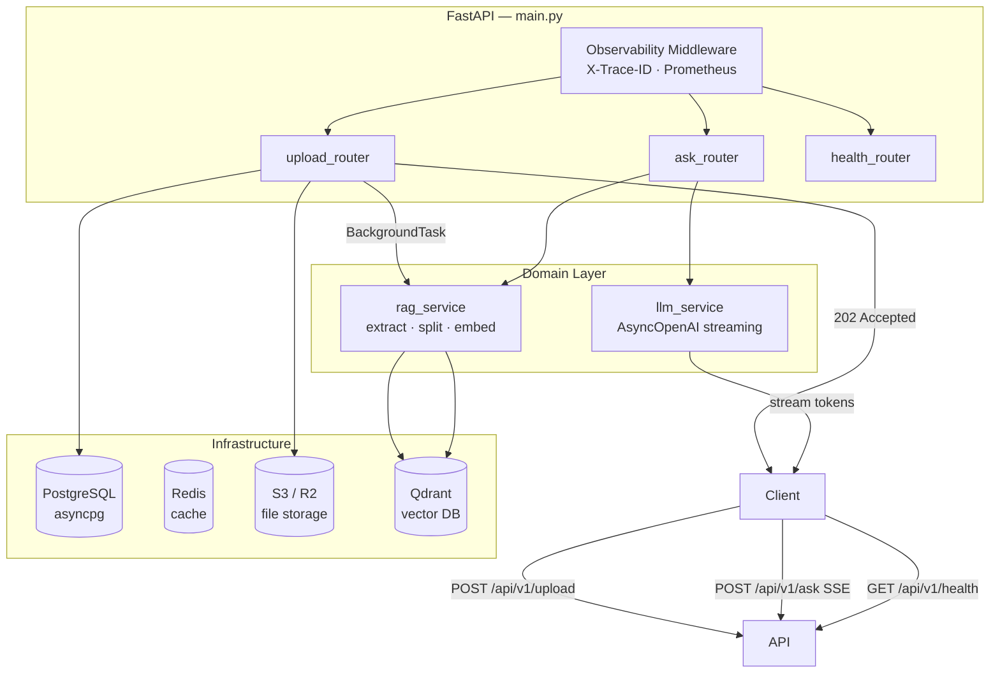

# Scalable AI Answering API

> **Enterprise-grade RAG microservice** — Clean Architecture · SSE Streaming · Qdrant · PostgreSQL · Redis · Prometheus · Kubernetes-ready

---

## Architecture



---

## Infrastructure Requirements

| Resource | Minimum | Recommended |
|----------|---------|-------------|
| RAM      | 16 GB   | 32 GB       |
| CPU      | 4 cores | 8 cores     |
| Disk     | 20 GB   | 50 GB SSD   |
| Docker   | 24+     |             |

### Service Memory Limits (docker-compose)

| Service    | Limit  |
|------------|--------|
| api        | 2 GB   |
| postgres   | 512 MB |
| redis      | 256 MB |
| vector-db  | 512 MB |

---

## Project Structure

```
senior_ai_api/
├── core/                      # Cross-cutting concerns
│   ├── config/settings.py     # Pydantic-settings, single .env
│   ├── logging.py             # JSON logs + X-Trace-ID context var
│   └── metrics.py             # Prometheus RED metrics
├── domain/
│   └── services/
│       ├── rag_service.py     # Business logic: extract·split·embed·retrieve
│       └── llm_service.py     # Streaming GPT-4o-mini with retry
├── infrastructure/
│   ├── db/                    # SQLAlchemy 2.0 async engine + ORM models
│   ├── repositories/          # Data access layer (DocumentRepository)
│   ├── cache/                 # Async Redis client
│   ├── storage/               # aioboto3 S3 layer
│   └── vector/                # Qdrant async client
├── interfaces/api/v1/         # Versioned FastAPI routers + Pydantic schemas
├── tests/                     # pytest-asyncio unit tests
├── alembic/                   # Database migrations
├── kubernetes/                # K8s manifests (Deployment, Service, Ingress…)
├── .github/workflows/         # CI/CD GitHub Actions
├── main.py                    # Lifespan, middleware, router mount
├── Dockerfile                 # Multi-stage build
├── docker-compose.yml         # Full local stack
└── requirements.txt
```

---

## Environment Variables

| Variable               | Default                          | Description                       |
|------------------------|----------------------------------|-----------------------------------|
| `OPENAI_API_KEY`       | —                                | OpenAI API key                    |
| `USE_MOCK`             | `false`                          | Bypass real API (dev/test)        |
| `POSTGRES_HOST`        | `postgres`                       | DB host                           |
| `POSTGRES_PASSWORD`    | `changeme`                       | DB password                       |
| `REDIS_URL`            | `redis://redis:6379/0`           | Redis connection string           |
| `S3_ENDPOINT_URL`      | *(empty = real AWS)*             | Override for R2/MinIO/Selectel    |
| `S3_BUCKET_NAME`       | `ai-answering-api`               | Upload bucket                     |
| `QDRANT_HOST`          | `vector-db`                      | Qdrant service host               |
| `EMBEDDING_MODEL`      | `all-MiniLM-L6-v2`               | HuggingFace embedding model       |
| `CHUNK_SIZE`           | `512`                            | Max chars per chunk               |
| `TOP_K_CHUNKS`         | `3`                              | Chunks retrieved per query        |
| `LOG_LEVEL`            | `INFO`                           | Logging verbosity                 |
| `PROMETHEUS_ENABLED`   | `true`                           | Expose /metrics endpoint          |

---

## Git Bash Quick Start

### 1 · Configure

```bash
cp .env.example .env
# Edit .env — fill in OPENAI_API_KEY and S3 credentials
```

### 2 · Initialise Git

```bash
git init
git branch -M main
git add .
git commit -m "feat: initial enterprise RAG architecture setup"
```

### 3 · Run full stack

```bash
docker-compose up --build -d
```

### 4 · Run database migrations

```bash
docker-compose exec api alembic upgrade head
```

### 5 · Upload a document

```bash
curl -X POST http://localhost:8000/api/v1/upload \
     -F "file=@/c/Users/you/report.pdf"
# Response 202 — indexing starts in background
```

### 6 · Ask a question (SSE stream)

```bash
curl -N -X POST http://localhost:8000/api/v1/ask \
     -H "Content-Type: application/json" \
     -H "X-Trace-ID: my-trace-123" \
     -d '{"question": "Summarise the main findings of the report."}'
# Tokens arrive in real-time as SSE events
```

### 7 · Health check

```bash
curl http://localhost:8000/api/v1/health
```

```json
{
  "status": "ok",
  "postgres": true,
  "redis": true,
  "s3": true,
  "vector_db": true
}
```

### 8 · Prometheus metrics

```bash
curl http://localhost:8000/metrics
```

### 9 · Interactive API docs

Open **http://localhost:8000/docs**

### 10 · Stop

```bash
docker-compose down
```

---

## Git Branch Strategy

| Branch    | Purpose                         |
|-----------|---------------------------------|
| `main`    | Production-ready, CI protected  |
| `develop` | Integration branch              |
| `feat/*`  | Feature branches                |
| `fix/*`   | Bug fix branches                |

---

## CI/CD Pipeline (.github/workflows/deploy.yml)

```
push to main / PR
       │
       ▼
 ┌─────────────┐    ┌──────────────┐    ┌──────────────────┐    ┌──────────────────┐
 │ lint        │───►│ test         │───►│ docker build+push│───►│ deploy simulation│
 │ black/flake8│    │ pytest-asyncio│    │ ghcr.io registry │    │ kubectl rollout  │
 └─────────────┘    └──────────────┘    └──────────────────┘    └──────────────────┘
```

---

## Push to GitHub

```bash
git remote add origin https://github.com/<your-username>/<repo-name>.git
git push -u origin main
```
