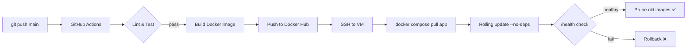

# Senior Cloud Production — FastAPI · Nginx · SSL · CI/CD

> **Production-ready** cloud infrastructure: HTTPS, zero-downtime deploys,
> automated SSL renewal, structured logging, and a full CI/CD pipeline via GitHub Actions.

---

## Architecture

```
┌─────────────────────────────────────────────────────────────────┐
│  Internet                                                        │
└──────────────────────┬──────────────────────────────────────────┘
                       │ :80 / :443
┌──────────────────────▼──────────────────────────────────────────┐
│  Nginx (SSL Termination · Rate Limiting · Security Headers)      │
│  ┌──────────────┐   ┌────────────────────────────────────────┐  │
│  │ HTTP → HTTPS │   │  Let's Encrypt (Certbot auto-renew)    │  │
│  └──────────────┘   └────────────────────────────────────────┘  │
└──────────────────────┬──────────────────────────────────────────┘
                       │ :8000 (internal Docker network)
┌──────────────────────▼──────────────────────────────────────────┐
│  FastAPI App (2 Uvicorn workers · JSON logging · /health)        │
└──────────────────────┬──────────────────────────────────────────┘
                       │ postgresql+asyncpg (isolated backend net)
┌──────────────────────▼──────────────────────────────────────────┐
│  PostgreSQL 15 (volume-persisted · healthcheck-gated startup)    │
└─────────────────────────────────────────────────────────────────┘

┌─────────────────────────────────────────────────────────────────┐
│  Dozzle :8080 (SSH-tunnel only · real-time log viewer)           │
└─────────────────────────────────────────────────────────────────┘
```

### CI/CD Flow



---

## Hardware Requirements (Local Development)

| Component | Minimum | Recommended |
|-----------|---------|-------------|
| CPU | i5-10300H (4c/8t) | i7-12th gen / Ryzen 7 |
| RAM | 8 GB | **16 GB** |
| GPU VRAM | — | **4 GB** (ML experiments) |
| Storage | 30 GB SSD | 100 GB NVMe |
| OS | Ubuntu 20.04+ / macOS 12+ / WSL2 | Ubuntu 22.04 LTS |

---

## Project Structure

```
senior_cloud_production/
├── .github/
│   └── workflows/
│       └── deploy.yml          # CI/CD: test → build → deploy
├── app/
│   ├── __init__.py
│   ├── main.py                 # FastAPI: /, /health, request logging
│   ├── logger.py               # Structured JSON logger
│   └── database.py             # Async SQLAlchemy 2.0
├── nginx/
│   └── nginx.conf              # Reverse proxy + TLS + rate limiting
├── scripts/
│   ├── init-ssl.sh             # One-time Let's Encrypt bootstrap
│   └── wait-for-db.sh          # TCP readiness probe
├── docs/
│   └── CLOUD_GUIDE.md          # VPC, Firewall, SSH, full deploy guide
├── Dockerfile                  # Multi-stage, non-root
├── docker-compose.prod.yml     # All services + networks + volumes
├── requirements.txt
├── .env.example
├── .gitignore
└── README.md
```

---

## Quick Start (Local)

```bash
cp .env.example .env              # edit POSTGRES_PASSWORD!
docker compose -f docker-compose.prod.yml up -d
curl http://localhost:8000/health
```

---

## Secrets Management Strategy

| Secret | Where stored | How used |
|--------|-------------|---------|
| DB password | `.env` (server only, in `.gitignore`) | Passed via `env_file` |
| Docker Hub token | GitHub Secrets | `docker/login-action` in CI |
| SSH private key | GitHub Secrets | `appleboy/ssh-action` deploy |
| `.env` contents | GitHub Secrets (`VM_ENV_FILE`) | Written to VM on each deploy |
| Dozzle password | `.env` | Container env var |

> ⚠️ **Never commit `.env`** — it is in `.gitignore`.  
> Generate passwords with: `openssl rand -base64 32`

---

## Cloud Deployment Guide

### 1. Firewall / Security Groups

Open **only** these ports:

| Port | Protocol | Source | Purpose |
|------|----------|--------|---------|
| **22** | TCP | Your IP only | SSH admin access |
| **80** | TCP | 0.0.0.0/0 | HTTP → HTTPS redirect + ACME |
| **443** | TCP | 0.0.0.0/0 | HTTPS traffic |
| 5432 | — | ❌ CLOSED | Postgres (Docker-internal only) |
| 8000 | — | ❌ CLOSED | FastAPI (behind Nginx) |
| 8080 | — | 127.0.0.1 | Dozzle (SSH tunnel only) |

**AWS:**
```
EC2 → Security Groups → Inbound rules → Add rule:
  Custom TCP | 80  | 0.0.0.0/0     | HTTP
  Custom TCP | 443 | 0.0.0.0/0     | HTTPS
  SSH        | 22  | <your-ip>/32  | Admin SSH
```

**GCP:**
```bash
gcloud compute firewall-rules create allow-web \
  --allow tcp:80,tcp:443 --source-ranges 0.0.0.0/0

gcloud compute firewall-rules create allow-ssh-admin \
  --allow tcp:22 --source-ranges <YOUR_IP>/32
```

### 2. Install Docker on Ubuntu 22.04 (one command)

```bash
curl -fsSL https://get.docker.com | sudo sh \
  && sudo usermod -aG docker $USER \
  && newgrp docker
```

### 3. Generate SSH key for GitHub Actions

Run this in **Git Bash** on your local machine:

```bash
# Generate dedicated key for CI/CD (no passphrase!)
ssh-keygen -t ed25519 -C "github-actions-deploy" -f ~/.ssh/github_actions_deploy -N ""

echo "── Public key (add to VM ~/.ssh/authorized_keys) ──"
cat ~/.ssh/github_actions_deploy.pub

echo ""
echo "── Private key (add to GitHub Secrets as VM_SSH_KEY) ──"
cat ~/.ssh/github_actions_deploy
```

On the VM:
```bash
echo "<paste public key here>" >> ~/.ssh/authorized_keys
chmod 600 ~/.ssh/authorized_keys
```

In GitHub: **Settings → Secrets → Actions → New repository secret**
| Secret | Value |
|--------|-------|
| `VM_SSH_KEY` | contents of `~/.ssh/github_actions_deploy` |
| `VM_HOST` | your VM public IP |
| `VM_USER` | `ubuntu` |
| `VM_DEPLOY_PATH` | `/home/ubuntu/app` |
| `VM_ENV_FILE` | full contents of your `.env` |
| `DOCKERHUB_USERNAME` | your Docker Hub username |
| `DOCKERHUB_TOKEN` | Docker Hub access token |

### 4. Full Deploy Sequence

```bash
# On VM — first time only
git clone https://github.com/YOUR/senior_cloud_production.git app
cd app
cp .env.example .env && nano .env        # set all passwords + DOMAIN

# Edit nginx.conf — replace YOUR_DOMAIN.COM with your actual domain
sed -i 's/YOUR_DOMAIN.COM/yourdomain.com/g' nginx/nginx.conf

# Start services (HTTP only first, for ACME challenge)
docker compose -f docker-compose.prod.yml up -d

# Issue SSL certificate (one time)
bash scripts/init-ssl.sh yourdomain.com admin@yourdomain.com

# Nginx reloads automatically — HTTPS is live
curl https://yourdomain.com/health
```

### 5. Monitor Logs

```bash
# All containers
docker compose -f docker-compose.prod.yml logs -f

# Specific service
docker compose -f docker-compose.prod.yml logs -f app

# Dozzle web UI (via SSH tunnel from local machine)
ssh -L 8080:localhost:8080 ubuntu@YOUR_VM_IP
# Then open: http://localhost:8080

# Healthcheck status
docker inspect fastapi_app | python3 -m json.tool | grep -A5 Health
```

---

## Git Bash — Initialize and Push

```bash
# 1. Init repo
git init
git branch -M main

# 2. Stage all files
git add .

# 3. First commit
git commit -m "feat: production-ready cloud infrastructure"

# 4. Add remote (create empty repo on GitHub first)
git remote add origin https://github.com/YOUR_USERNAME/senior_cloud_production.git

# 5. Push
git push -u origin main
# CI/CD pipeline will trigger automatically on this push!
```

---

## ZIP Archive (save before push)

```bash
zip -r senior_cloud_production.zip senior_cloud_production \
  --exclude "*.pyc" --exclude "*/__pycache__/*" --exclude "*/.env"
```

---

## Observability with Dozzle

Dozzle provides a lightweight real-time log viewer with:
- Live streaming of all container logs
- Container health status dashboard
- Search & filter by container / log level
- No data persistence (privacy-friendly)
- Protected by username/password (set in `.env`)

Access via SSH tunnel (never expose port 8080 publicly):
```bash
ssh -L 8080:localhost:8080 ubuntu@YOUR_VM_IP -N &
open http://localhost:8080
```
