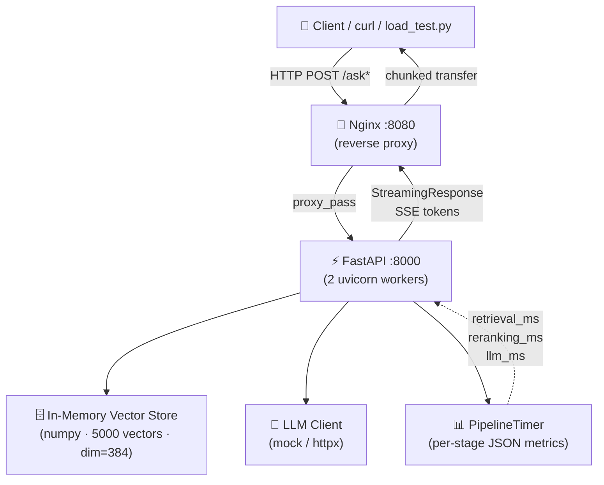

# 🚀 Senior RAG Performance Diagnostic Stand

> **Principal AI Engineer / Solutions Architect** training project.
> Reproduce three critical production bottlenecks in a RAG pipeline,
> profile each stage independently, and apply production-grade fixes.

---

## Hardware Requirements

| Resource | Minimum | Dev Machine (this project) |
|----------|---------|---------------------------|
| CPU      | 2 cores | **4+ cores** recommended  |
| RAM      | 4 GB    | **16 GB** recommended     |
| Docker   | 24+     | latest                    |
| Python   | 3.10+   | 3.11+ for local tests     |

---

## Architecture



### The Three Bottlenecks

```
❌ Bottleneck #1 — Blocking I/O
   time.sleep(3s) inside async def → blocks event loop
   → all concurrent requests queue up behind it

❌ Bottleneck #2 — LLM Timeout
   synchronous call with no timeout → worker hangs 6-20s
   → combined with Bottleneck #1 total = 9s+

❌ Bottleneck #3 — Nginx Misconfiguration
   proxy_read_timeout 5s → LLM takes 9s → 504 Gateway Timeout
   proxy_buffering on   → streaming tokens buffered, TTFT = full latency
```

---

## Project Structure

```
senior_rag_performance_fix/
├── app/
│   ├── main.py                     # FastAPI app factory + lifespan
│   ├── api/
│   │   ├── rag.py                  # POST /ask ❌  /ask-optimized ✅  /ask-stream ✅
│   │   └── health.py               # GET /health  /health/ready
│   ├── core/
│   │   ├── config.py               # Pydantic-Settings v2
│   │   ├── models.py               # Request/Response schemas
│   │   ├── vector_store.py         # FAISS-like numpy store (blocking + async)
│   │   ├── llm_client.py           # Blocking / async / streaming LLM mocks
│   │   └── logging_config.py       # QueueHandler — async-safe logging
│   └── profiler/
│       ├── timer.py                # Per-stage async context-manager timer
│       └── middleware.py           # Request-level JSON timing middleware
├── nginx/
│   ├── nginx.conf                  # ✅ Fixed (generous timeouts, buffering off)
│   └── nginx.buggy.conf            # ❌ Buggy (5s timeout, buffering on)
├── scripts/
│   └── load_test.py                # Async httpx load tester
├── tests/
│   └── test_rag.py                 # Pytest unit tests (mocked)
├── docker-compose.yml              # ✅ Fixed stack
├── docker-compose.buggy.yml        # ❌ Buggy stack
├── Dockerfile                      # Multi-stage python:3.10-slim
├── requirements.txt
├── .env.example
└── README.md
```

---

## Step-by-Step Guide (Git Bash)

### Step 0 — Setup

```bash
cd senior_rag_performance_fix
cp .env.example .env
```

---

### Step 1 — Reproduce the Bottlenecks ❌

```bash
docker-compose -f docker-compose.buggy.yml up --build -d
docker-compose -f docker-compose.buggy.yml logs -f api
```

In a second terminal:

```bash
# Expect ~9 seconds latency OR 504 Gateway Timeout from Nginx
time curl -s -X POST http://localhost:8080/ask \
  -H "Content-Type: application/json" \
  -d '{"query": "How does RAG work?", "top_k": 3}' | python -m json.tool
```

**Diagnosing which stage is hanging** — watch the logs:
```
# Retrieval bottleneck marker:
❌ [BOTTLENECK] retrieve_blocking called — blocking event loop for 3.0s

# LLM bottleneck marker:
❌ [BOTTLENECK] call_llm_blocking — no timeout, sleeping 6.0s

# Stage timings emitted by PipelineTimer:
stage_complete | stage=retrieval      | duration_ms=3002.14
stage_complete | stage=reranking      | duration_ms=0.41
stage_complete | stage=llm_generation | duration_ms=6004.88
```

If Nginx returns 504 before the logs show `llm_generation` complete,
**Bottleneck #3** is the root cause — timeout fires before LLM finishes.

```bash
# Tear down buggy stack
docker-compose -f docker-compose.buggy.yml down -v
```

---

### Step 2 — Apply the Fixes ✅

```bash
docker-compose up --build -d
docker-compose logs -f api
```

```bash
# /ask-optimized — async, no blocking, explicit timeout
time curl -s -X POST http://localhost:8080/ask-optimized \
  -H "Content-Type: application/json" \
  -d '{"query": "How does RAG work?", "top_k": 3}' | python -m json.tool

# /ask-stream — Server-Sent Events, TTFT ~200ms
curl -s -X POST http://localhost:8080/ask-stream \
  -H "Content-Type: application/json" \
  -d '{"query": "Explain vector similarity search", "top_k": 3}'
```

**Fixed log pattern:**
```
✅ /ask-optimized called
stage_complete | stage=retrieval      | duration_ms=52.3
stage_complete | stage=reranking      | duration_ms=0.3
stage_complete | stage=llm_generation | duration_ms=110.7
✅ /ask-optimized complete | timings={...}
```

---

### Step 3 — Run the Load Test

```bash
pip install httpx   # if running locally outside Docker

# Test both endpoints: 6 requests, 3 concurrent
python scripts/load_test.py --host http://localhost:8080 --concurrency 3 --requests 6

# Test optimized only
python scripts/load_test.py --endpoint optimized --concurrency 5 --requests 10
```

---

### Step 4 — Run Unit Tests

```bash
pip install -r requirements.txt
pytest tests/ -v
```

---

### Step 5 — Commit to Git

```bash
git init
git add .
git commit -m "fix: eliminate RAG bottlenecks, optimize nginx timeouts and enable token streaming"

# Push to GitHub
git remote add origin https://github.com/YOUR_USER/senior_rag_performance_fix.git
git push -u origin main
```

---

## Fix Summary Table

| # | Bottleneck | Root Cause | Fix |
|---|-----------|-----------|-----|
| 1 | Blocking I/O | `time.sleep()` in async context | `asyncio.sleep()` + `run_in_executor` for CPU work |
| 2 | LLM Timeout | `requests.get()` with no timeout | `httpx.AsyncClient(timeout=30)` |
| 3 | Nginx 504 | `proxy_read_timeout 5s` | `proxy_read_timeout 60s` + `proxy_buffering off` for streaming |

## Profiling Output Format

Each request emits a JSON timing object:
```json
{
  "retrieval_time_ms": 52.3,
  "reranking_time_ms": 0.3,
  "llm_generation_time_ms": 110.7,
  "total_time_ms": 168.4
}
```
Use this to localize the bottleneck: if `retrieval_time_ms` >> 100ms,
fix the vector store. If `llm_generation_time_ms` is the outlier,
address the LLM client or switch to streaming.
