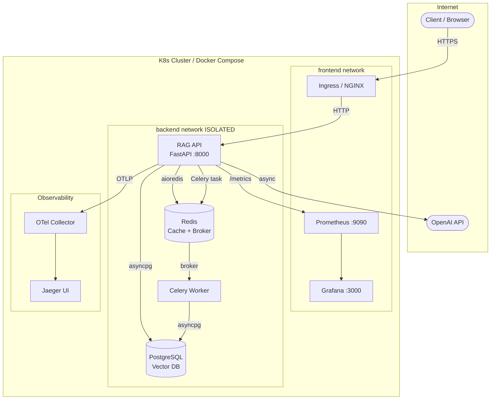

# Senior Enterprise RAG/LLM Audit Stand 🏗️

Стенд архитектурного аудита уровня **Senior** / **Principal**.
Воспроизводит реальный корпоративный RAG-сервис с критическими
инфраструктурными проблемами и их production-ready решениями.

---

## Infrastructure Requirements

| Параметр | Минимум | Рекомендуется |
|----------|---------|---------------|
| RAM | 8 GB | **16 GB** |
| CPU | 2 ядра | **4+ ядра** |
| Disk | 20 GB SSD | 50 GB NVMe |
| Docker | 24+ | Latest |
| kubectl | 1.28+ | Latest |
| Python | 3.11+ | 3.12 |
| OS | Ubuntu 22.04 / macOS 13 | Latest |

---

## Архитектурная схема системы



---

## Структура проекта

```
senior_rag_audit_project/
├── target_service/              ← AUDIT TARGET (6 blocker проблем)
│   ├── app/main.py              ← монолит с #!SCALE #!SEC #!OBS #!RESILIENCE
│   ├── worker/tasks.py          ← Celery с хардкодом
│   ├── Dockerfile               ← root-пользователь, секреты в ENV
│   └── requirements.txt
├── patched_service/             ← Production-Ready архитектура
│   ├── app/
│   │   ├── main.py              ← async FastAPI + middleware + health
│   │   ├── config.py            ← pydantic-settings
│   │   ├── observability.py     ← JSON logs + OTel трассирование
│   │   ├── resilience.py        ← Circuit Breaker + Retry
│   │   ├── llm_service.py       ← AsyncOpenAI + кэш + метрики
│   │   ├── metrics.py           ← Prometheus бизнес-метрики
│   │   └── schemas.py           ← Pydantic v2
│   ├── Dockerfile               ← multi-stage, non-root, healthcheck
│   └── requirements.txt
├── k8s/
│   ├── target/                  ← K8s манифесты с проблемами
│   │   ├── deployment.yaml      ← нет HPA, нет PVC, секреты в YAML
│   │   └── service.yaml
│   └── patched/                 ← Production-Ready манифесты
│       ├── namespace.yaml
│       ├── secret.yaml          ← шаблон (значения через ESO/Vault)
│       ├── configmap.yaml
│       ├── deployment.yaml      ← HPA + securityContext + probes
│       ├── redis.yaml           ← StatefulSet + PVC
│       ├── network-policy.yaml  ← изоляция сети
│       └── pdb.yaml             ← Pod Disruption Budget
├── .github/workflows/
│   ├── target_ci.yml            ← спагетти CI/CD
│   └── patched_ci.yml          ← 5-stage pipeline с SAST и canary
├── monitoring/
│   └── prometheus.yml
├── docker-compose.target.yml    ← запуск audit target
├── docker-compose.patched.yml   ← запуск patched версии
├── docs/
│   └── PRODUCTION_AUDIT.md     ← полный аудит отчёт
├── .env.example
├── .gitignore
└── README.md
```

---

## Шаг 1 — Анализ Audit Target

```bash
cd senior_rag_audit_project

# Изучить антипаттерны (помечены #!SCALE #!SEC #!OBS #!RESILIENCE #!COST #!MAINT)
cat target_service/app/main.py

# Изучить проблемные K8s манифесты
cat k8s/target/deployment.yaml

# Прочитать полный аудит отчёт
cat docs/PRODUCTION_AUDIT.md
```

---

## Шаг 2 — Запуск Patched-версии (Docker Compose)

```bash
# Скопировать и заполнить .env
cp .env.example .env
# Обязательно: OPENAI_API_KEY, REDIS_PASSWORD, POSTGRES_PASSWORD, API_TOKEN_SECRET

# Запустить весь стек в фоне
docker-compose -f docker-compose.patched.yml up --build -d

# Проверить статус всех сервисов
docker-compose -f docker-compose.patched.yml ps

# Health checks
curl http://localhost:8000/health/live
curl http://localhost:8000/health/ready

# Swagger UI (только в DEBUG режиме)
# http://localhost:8000/docs

# Метрики Prometheus
# http://localhost:9090

# Grafana
# http://localhost:3000  (admin / $GRAFANA_PASSWORD)

# Логи в реальном времени (JSON формат)
docker-compose -f docker-compose.patched.yml logs -f api

# Остановить стек
docker-compose -f docker-compose.patched.yml down
```

---

## Шаг 3 — Валидация K8s манифестов

```bash
# Проверить синтаксис манифестов (без кластера)
kubectl apply --dry-run=client -f k8s/patched/

# Проверить с kube-score (качество манифестов)
kube-score score k8s/patched/*.yaml

# Lint с kubeval
kubeval k8s/patched/*.yaml

# Применить в кластер (minikube / kind / облако)
kubectl apply -f k8s/patched/namespace.yaml
kubectl apply -f k8s/patched/
kubectl get all -n rag-prod
kubectl get hpa -n rag-prod
```

---

## Шаг 4 — Публикация на GitHub (Git Bash)

```bash
git init
git add .
git commit -m "feat: complete senior enterprise readiness audit and infrastructure patching"

git remote add origin https://github.com/YOUR_USERNAME/senior-rag-audit.git
git branch -M main
git push -u origin main
```

---

## Тест API (patched версия)

```bash
# RAG Query
curl -X POST http://localhost:8000/rag/query \
  -H "Content-Type: application/json" \
  -H "X-API-Token: your_api_token_secret" \
  -d '{"query": "Explain the concept of semantic caching in RAG systems"}'

# Ingest documents
curl -X POST http://localhost:8000/rag/ingest \
  -H "Content-Type: application/json" \
  -H "X-API-Token: your_api_token_secret" \
  -d '{"documents": [{"content": "RAG stands for Retrieval Augmented Generation", "source": "docs"}]}'
```

---

## Ключевые технологии

| Слой | Audit Target | Production-Ready |
|------|-------------|-----------------|
| LLM Client | `OpenAI()` (sync) | `AsyncOpenAI()` + Circuit Breaker |
| Резилиентность | Нет | Circuit Breaker + Exponential Retry |
| БД-драйвер | `psycopg2` (sync) | `asyncpg` + SQLAlchemy 2.0 async |
| Кэш | Точный, TTL=60s | SHA-256, TTL=3600s + метрики |
| Конфигурация | `os.environ` + хардкод | `pydantic-settings` + K8s Secrets |
| Логирование | `print()` / файл | JSON stdout + Trace-ID + OTel |
| Метрики | Нет | Prometheus + Grafana (tokens, cost) |
| K8s scaling | 1 реплика, нет HPA | HPA (2-10 реплик, CPU+MEM) |
| Безопасность | Root, секреты в YAML | Non-root, NetworkPolicy, Secrets |
| CI/CD | 1 job, нет тестов | 5-stage + SAST + canary |

---

## Полезные ссылки

- [12-Factor App](https://12factor.net)
- [OWASP Kubernetes Top 10](https://owasp.org/www-project-kubernetes-top-ten/)
- [Google SRE Book](https://sre.google/sre-book/table-of-contents/)
- [AsyncOpenAI](https://github.com/openai/openai-python#async-usage)
- [OpenTelemetry Python](https://opentelemetry.io/docs/instrumentation/python/)
